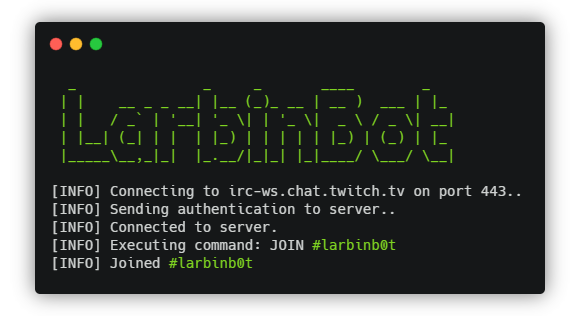

# LarbinBot

[](https://codecov.io/gh/Ealenn/LarbinBot)
[](https://github.com/Ealenn/LarbinBot/stargazers)
[](https://github.com/Ealenn/LarbinBot/issues)


Completely customizable Twitch Bot. 



```bash
docker run --rm \
  -e DEBUG=true \
  -e LARBIN_TWITCH_USERNAME= Larbin \
  -e LARBIN_TWITCH_PASSWORD= oic:password \
  -e LARBIN_TWITCH_CHANNEL= example \
  -e LARBIN_FILE= /bot \
  -v $PWD/config:/bot \
  ealenn/larbinbot
```

More information about deployment here [https://ealenn.github.io/LarbinBot/deployment](https://ealenn.github.io/LarbinBot/deployment)

## Version

The versioning scheme is [SemVer](http://semver.org/).

``` yml
- latest: Master Build
- x.x.x: Release version x.x.x
- snapshot: Pull Request / Internal Tests
```

## Environment Variables

``` bash
# Path to larbin.yml configuration file
LARBIN_FILE=/tmp
# Debug mode
DEBUG=true
# Single command threshold per second
LARBIN_THRESHOLD=5

# Twitch Credentials (mandatory)
LARBIN_TWITCH_USERNAME: Larbin
LARBIN_TWITCH_PASSWORD: oic:password
LARBIN_TWITCH_CHANNEL: example
```

## Larbin Configuration File (LCF)

You must configure this bot with configuration file `larbin.yml`. 
This file contain all actions/events and commands.

More information about Larbin Configuration File here [https://ealenn.github.io/LarbinBot/configuration](https://ealenn.github.io/LarbinBot/configuration)

``` yaml
tools:
  commands:
    # Command to start/stop schedulers
    # (The schedulers is started by default on bot starting.)
    # Example:
    # !schedulers status
    # !schedulers on
    # !schedulers off
    - type: schedulers
      name: '!schedulers'
      policies:
        mod: true
        admin: true
      argOn: 'on'
      argOff: 'off'
      argStatus: 'status'
commands:
  - name: '!facebook' # Command to write 
    random: false # Takes a random message from the list rather than following the order of the list
    policies:
      others: true # All
    messages: 
      - 'My Facebook is https://facebook.com/example'
      - 'Like my Facebook page https://facebook.com/example'
  - name: '!twitter'
    policies:
      others: true # All
    messages: 
      - 'My Twitter is https://twitter.com/example (This question has been asked {{ Count }} times)'
schedulers:
  - id: 'social' # Required, is only used to make this scheduler unique
    minutes: 10 # Send message every minutes
    random: true # Takes a random message from the list rather than following the order of the list 
    messages:
    - 'Follow me on Twitter https://twitter.com/example'
  - id: 'other'
    minutes: 5
    messages:
    - 'Text rolling 1'
    - 'Text rolling 2'
    - 'Text rolling 3'
events:
  - name: 'join' # Event type
    random: true # Takes a random message from the list rather than following the order of the list 
    messages:
      - 'Less noise {{ Username }} is coming!'
      - 'Ah! We are talking about you {{ Username }} !'
  - name: 'raided'
    messages: 
      - 'Thanks to {{ Username }} for this raid of {{ Viewers }} viewers !'
  - name: 'resub'
    messages: 
      - 'Thanks {{ Username }} for your {{ Months }} with us ! -- {{ Username }} say: {{ Message }}'
  - name: 'submysterygift'
    messages: 
      - '{{ Username }} is rich and he just offered {{ OfferedSubs }} subscription! Thank him in the chat! (with a total of {{ GiftCount }} subscription offered)'
  - name: 'subgift'
    messages: 
      - 'Hey ! {{ Username }} is {{ GiftCount }}x more generous with {{ RecipientUsername }} !'
  - name: 'subscription'
    messages: 
      - 'I know someone from sub, but, I say anything, alright {{ Username }} ?'
```

### Policies

**Warning**, by default, everything is blocked for everyone. You must allow at least one.

``` yaml
# DEFAULT POLICIES VALUES
policies:
  admin: false # Allow Admins/Streamer
  mod: false # Allow Moderators
  vip: false # Allow VIP
  sub: false # Allow Subscriber
  others: false # Allow/Disallow all/others
```
